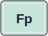
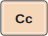
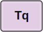
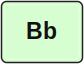
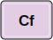
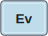

# Periodic Table of Computer System Design Principles

#### [Joy Arulraj (Georgia Tech)](https://faculty.cc.gatech.edu/~jarulraj/)

System design is often taught through  solutions specific to particular domains, such as databases, operating systems, or computer architecture, each with its own methods and vocabulary. While this diversity is a strength, it can obscure cross-cutting principles that recur across domains. This paper proposes a preliminary taxonomy of system design principles distilled from several domains in computer systems. The goal is a shared, concise vocabulary that helps students, researchers, and practitioners reason about structure and trade-offs, compare designs across domains, and communicate choices more clearly.

## 1. INTRODUCTION

One of the rewards of working in computer systems is the field’s sheer diversity, spanning operating systems, databases, computer architecture, distributed systems, programming languages, networking, and more, each with a rich history. For newcomers, it can be challenging to spot connections across different domains due to the diversity of traditions and vocabularies: the same design principle may appear in different guises across domains.

For example, consider the classic paper on database isolation levels by Jim Gray et al. <a href="#user-content-ref-17">[17]</a>. It offers a careful account of concurrency-control mechanisms and the trade-offs between correctness and performance. Yet without prior exposure to similar issues in operating systems or computer architecture, the ideas can appear narrowly “about databases.” In reality, the same design principle, [Consistency Relaxation (Cr)](#user-content-principle-cr), reappears across systems in different guises -- from weakly ordered memory hierarchies to eventual-consistency protocols in distributed systems. When each community uses its own terms and exemplars, newcomers may find it difficult to recognize the underlying design principles. This fragmentation increases cognitive overhead, as the same trade-off must be relearned in each context.

This is a broader pattern: systems research is rich in practical insight but lighter on shared conceptual scaffolding. Across domains, similar challenges recur, such as managing concurrency, ensuring consistency, and adapting to change, while the framing and vocabulary often differ. As a result, deep connections between seemingly disparate domains can remain relatively obscure.

This article is a small step toward bridging those gaps. Borrowing Mendeleev’s metaphor, we present a "periodic table" of recurring system design principles. The goal is not a rigid taxonomy but a working vocabulary: a concise way to annotate papers, lectures, and design documents with the fundamental principles they employ. The aim is to surface structure that already exists in computer systems, so that students can form a more coherent mental map, researchers can situate contributions with precision, and practitioners can discuss design choices across domains with greater clarity.

## 2. METHODOLOGY

We identified principles by going over 100+ influential papers across operating systems, computer architecture, databases, networking, programming languages, security, and other domains in computer systems. These papers were chosen for historical significance and ongoing relevance, such as classic papers on concurrency control <a href="#user-content-ref-17">[17]</a> and consensus <a href="#user-content-ref-25">[25]</a>, and more recent work on using machine learning inside systems <a href="#user-content-ref-22">[22]</a> and designing systems for the cloud <a href="#user-content-ref-6">[6]</a>. 

For each paper we asked: what is the underlying high-level design principle? Across domains, independent systems often converged not on mechanisms but on shared design principles: for example, [relaxing consistency](#user-content-principle-cr) to improve performance or [lifting abstractions](#user-content-principle-al) to enhance usability. 

To qualify as a system design principle, it must satisfy two conditions:

1. **Abstract** – The principle must be independent of specific technologies or implementations.  
2. **Generality** – The principle must show up across different domains (e.g., database systems, operating systems, programming languages).

This analysis does not aim to catalogue every principle, but to surface many of those with lasting, general-purpose value.

## 3. THE DESIGN PRINCIPLE TABLE

We have curated a structured set of 40+ general-purpose design principles distilled from the systems literature. As shown in Table 1, they are organised into thematic groups that mirror familiar axes of system design.

Each principle is tagged with a short symbol (e.g., [`Co`](#user-content-principle-co) for composability, [`Op`](#user-content-principle-op) for optimistic design) for quick reference. We emphasise **design intent** rather than prescribing mechanisms: instead of “use this locking protocol” or “optimise this query plan,” the principles state aims such as “preserve correctness under concurrency” or “prioritise the common case,” leaving concrete realisations to specific domains.

## Table of Contents

- [ Group 1: Structure](#user-content-group-1-structure): *Control complexity by choosing boundaries that make parts understandable, replaceable, and extensible.*
- [ Group 2: Efficiency](#user-content-group-2-efficiency): *Improve performance by reducing unnecessary work and matching effort to dominant costs.*
- [ Group 3: Semantics](#user-content-group-3-semantics): *Make behavior explicit enough to reason about, transform, and preserve.*
- [ Group 4: Distribution](#user-content-group-4-distribution): *Manage state, computation, and coordination when a system spans machines.*
- [ Group 5: Planning](#user-content-group-5-planning): *Turn goals and constraints into concrete choices among alternative designs or executions.*
- [ Group 6: Operability](#user-content-group-6-operability): *Keep systems understandable and adjustable as workloads, resources, and requirements change.*
- [ Group 7: Reliability](#user-content-group-7-reliability): *Preserve acceptable behavior under failure, interference, concurrency, and weaker guarantees.*
- [ Group 8: Security](#user-content-group-8-security): *Limit authority and isolate effects so misuse or compromise remains contained.*

**Legend:** `Code` = unique short symbol, `Name` = principle, `Intent` = short description.

<a id="principle-table"></a>

<table>
  <thead>
    <tr>
      <th align="center"><a href="#user-content-group-1-structure">Group 1<br>Structure</a></th>
      <th align="center"><a href="#user-content-group-2-efficiency">Group 2<br>Efficiency</a></th>
      <th align="center"><a href="#user-content-group-3-semantics">Group 3<br>Semantics</a></th>
      <th align="center"><a href="#user-content-group-4-distribution">Group 4<br>Distribution</a></th>
      <th align="center"><a href="#user-content-group-5-planning">Group 5<br>Planning</a></th>
      <th align="center"><a href="#user-content-group-6-operability">Group 6<br>Operability</a></th>
      <th align="center"><a href="#user-content-group-7-reliability">Group 7<br>Reliability</a></th>
      <th align="center"><a href="#user-content-group-8-security">Group 8<br>Security</a></th>
    </tr>
  </thead>
  <tbody>
    <tr>
      <td align="center"><a href="#user-content-principle-si"></a></td>
      <td align="center"><a href="#user-content-principle-sc"></a></td>
      <td align="center"><a href="#user-content-principle-al"></a></td>
      <td align="center"><a href="#user-content-principle-lt"></a></td>
      <td align="center"><a href="#user-content-principle-ep"></a></td>
      <td align="center"><a href="#user-content-principle-ad"></a></td>
      <td align="center"><a href="#user-content-principle-ft"></a></td>
      <td align="center"><a href="#user-content-principle-sy"></a></td>
    </tr>
    <tr>
      <td align="center"><a href="#user-content-principle-mo"></a></td>
      <td align="center"><a href="#user-content-principle-rc"></a></td>
      <td align="center"><a href="#user-content-principle-lu"></a></td>
      <td align="center"><a href="#user-content-principle-dc"></a></td>
      <td align="center"><a href="#user-content-principle-cm"></a></td>
      <td align="center"><a href="#user-content-principle-ec"></a></td>
      <td align="center"><a href="#user-content-principle-is"></a></td>
      <td align="center"><a href="#user-content-principle-ac"></a></td>
    </tr>
    <tr>
      <td align="center"><a href="#user-content-principle-co"></a></td>
      <td align="center"><a href="#user-content-principle-wv"></a></td>
      <td align="center"><a href="#user-content-principle-se"></a></td>
      <td align="center"><a href="#user-content-principle-fp"></a></td>
      <td align="center"><a href="#user-content-principle-cp"></a></td>
      <td align="center"><a href="#user-content-principle-wa"></a></td>
      <td align="center"><a href="#user-content-principle-at"></a></td>
      <td align="center"><a href="#user-content-principle-lp"></a></td>
    </tr>
    <tr>
      <td align="center"><a href="#user-content-principle-ex"></a></td>
      <td align="center"><a href="#user-content-principle-cc"></a></td>
      <td align="center"><a href="#user-content-principle-fs"></a></td>
      <td align="center"><a href="#user-content-principle-lo"></a></td>
      <td align="center"><a href="#user-content-principle-gd"></a></td>
      <td align="center"><a href="#user-content-principle-au"></a></td>
      <td align="center"><a href="#user-content-principle-cr"></a></td>
      <td align="center"><a href="#user-content-principle-tq"></a></td>
    </tr>
    <tr>
      <td align="center"><a href="#user-content-principle-pm"></a></td>
      <td align="center"><a href="#user-content-principle-bo"></a></td>
      <td align="center"><a href="#user-content-principle-ig"></a></td>
      <td align="center"><a href="#user-content-principle-cz"></a></td>
      <td align="center"><a href="#user-content-principle-bb"></a></td>
      <td align="center"><a href="#user-content-principle-ho"></a></td>
      <td align="center">&nbsp;</td>
      <td align="center"><a href="#user-content-principle-cf"></a></td>
    </tr>
    <tr>
      <td align="center"><a href="#user-content-principle-gr"></a></td>
      <td align="center"><a href="#user-content-principle-ha"></a></td>
      <td align="center">&nbsp;</td>
      <td align="center">&nbsp;</td>
      <td align="center"><a href="#user-content-principle-ah"></a></td>
      <td align="center"><a href="#user-content-principle-ev"></a></td>
      <td align="center">&nbsp;</td>
      <td align="center"><a href="#user-content-principle-sa"></a></td>
    </tr>
    <tr>
      <td align="center"><a href="#user-content-principle-pd"></a></td>
      <td align="center"><a href="#user-content-principle-op"></a></td>
      <td align="center">&nbsp;</td>
      <td align="center">&nbsp;</td>
      <td align="center">&nbsp;</td>
      <td align="center">&nbsp;</td>
      <td align="center">&nbsp;</td>
      <td align="center">&nbsp;</td>
    </tr>
    <tr>
      <td align="center">&nbsp;</td>
      <td align="center"><a href="#user-content-principle-la"></a></td>
      <td align="center">&nbsp;</td>
      <td align="center">&nbsp;</td>
      <td align="center">&nbsp;</td>
      <td align="center">&nbsp;</td>
      <td align="center">&nbsp;</td>
      <td align="center">&nbsp;</td>
    </tr>
  </tbody>
</table>


<a id="group-1-structure"></a>

##  Group 1: Structure

<a id="principle-si"></a>
 **Si – Simplicity**

Choose the simplest system design that meets current needs; resist complexity, such as additional layers, services, or generality added "just in case", until evidence shows benefit. 

**Example:** Avoid premature architectural optimisation of the system <a href="#user-content-ref-23">[23]</a>.

<sub><a href="#user-content-principle-table">back to table</a></sub>

<a id="principle-mo"></a>
 **Mo – Modularity**

Partition the system into cohesive units with minimal interfaces, so that each unit can be reasoned about, replaced, or evolved independently. This principle focuses on decomposition: choosing boundaries to favor clear separation of concerns so that each responsibility sits in one module.

**Example:** The OSI model decomposes communication into standardised layers with well-defined boundaries that permit independent development and substitution <a href="#user-content-ref-48">[48]</a>.

<sub><a href="#user-content-principle-table">back to table</a></sub>

<a id="principle-co"></a>
 **Co – Composability**

Design components that can be safely and flexibly recombined; rely on explicit contracts and type-constrained interfaces so that every legal composition remains correct, letting components be assembled like interchangeable bricks. Unlike modularity, this principle focuses on re-composition: making sure the components can be combined safely and flexibly.

**Example:** Unix programs (e.g., grep, sort, uniq) read from stdin and write to stdout, letting the user compose complex text processing pipelines <a href="#user-content-ref-41">[41]</a>.

<sub><a href="#user-content-principle-table">back to table</a></sub>

<a id="principle-ex"></a>
 **Ex – Extensibility**

Design systems to allow safe user-defined extensions, such as plug-ins, without requiring changes to the system core. When extensions come from untrusted parties, isolate them through sandboxing to preserve safety.

**Example:** Unix also illustrates extensibility: new programs can be added by the user without kernel changes <a href="#user-content-ref-41">[41]</a>.

<sub><a href="#user-content-principle-table">back to table</a></sub>

<a id="principle-pm"></a>
 **Pm – Policy/Mechanism Separation**

Separate what should be done (policy) from how it is carried out (mechanism) by exposing a common interface through which multiple policies can plug into the same mechanism.

**Example:** Hydra has a kernel of generic mechanisms (scheduling, paging, protection) and moved resource-allocation policies to user-level modules <a href="#user-content-ref-32">[32]</a>.

<sub><a href="#user-content-principle-table">back to table</a></sub>

<a id="principle-gr"></a>
 **Gr – Generalized Design**

Design a single core with explicit variation points like types, knobs, or plug-ins, so that it can serve many use cases without duplication, but specialise when doing so yields meaningful gains in performance, accuracy, or clarity.

**Example:** The C++ Standard Template Library is a collection of containers, iterators, and algorithms parameterized by templates <a href="#user-content-ref-45">[45]</a>. Postgres allows users to add types and operators to the core database system <a href="#user-content-ref-46">[46]</a>.

<sub><a href="#user-content-principle-table">back to table</a></sub>

<a id="principle-pd"></a>
 **Pd – Probabilistic Design** 

Introduce controlled randomness to gain efficiency, scalability, or simplicity while accepting a small, quantified risk of error or loss.

**Example:** Routers treat queue length as a probability signal: as the queue grows, they drop incoming packets with increasing probability, proactively signalling congestion <a href="#user-content-ref-13">[13]</a>.

<sub><a href="#user-content-principle-table">back to table</a></sub>

<a id="group-2-efficiency"></a>

##  Group 2: Efficiency

<a id="principle-sc"></a>
 **Sc – Scalability**

Design the system to handle growth in data, traffic, or nodes with near-linear cost or latency.

**Example:** MapReduce scales across nodes by dividing work into parallel tasks and aggregating results with minimal coordination <a href="#user-content-ref-10">[10]</a>.

<sub><a href="#user-content-principle-table">back to table</a></sub>

<a id="principle-rc"></a>
 **Rc – Reuse of Computation**

Avoid redundant work by caching, materializing intermediate results (e.g., indexes), or incrementally updating outputs across repeated or slightly modified inputs, saving computation.

**Example:** A B+tree reuses its sorted key order: lookups follow the existing search path instead of rescanning the entire data set each time, thereby reusing computation <a href="#user-content-ref-2">[2]</a>.

<sub><a href="#user-content-principle-table">back to table</a></sub>

<a id="principle-wv"></a>
 **Wv – Work Avoidance**

Skip computation that would not alter externally observable results. Examples include lazy evaluation and predicate short-circuiting.

**Example:** Lazy evaluation defers work until a value is demanded, eliminating useless computation <a href="#user-content-ref-19">[19]</a>.

<sub><a href="#user-content-principle-table">back to table</a></sub>

<a id="principle-cc"></a>
 **Cc – Common-Case Specialization**

Detect the execution paths or data items that dominate run-time ("hot spots") and create a streamlined fast path just for them, while a slower, general path still handles every case correctly.

**Example:** Caching the target method for the receiver class on the first call, so that subsequent calls on that common receiver hit the fast path; uncommon classes fall back to the full method-lookup routine <a href="#user-content-ref-5">[5]</a>.

<sub><a href="#user-content-principle-table">back to table</a></sub>

<a id="principle-bo"></a>
 **Bo – Bottleneck-Oriented Optimisation**

Profile end-to-end performance, locate the tightest resource constraint, and focus improvement effort there until another stage becomes the limiter.

**Example:** Rare 99th-percentile stragglers bottleneck latency, and replicated requests help cut tail response times <a href="#user-content-ref-9">[9]</a>.

<sub><a href="#user-content-principle-table">back to table</a></sub>

<a id="principle-ha"></a>
 **Ha – Hardware-Aware Design**

Shape algorithms and data structures to the latency, bandwidth, parallelism, and persistence properties of underlying hardware (e.g., cache hierarchy, NUMA, SSDs, GPUs).

**Example:** BLAS defines cache- and vector-tuned kernels so linear-algebra code exploits hardware efficiently <a href="#user-content-ref-31">[31]</a>.

<sub><a href="#user-content-principle-table">back to table</a></sub>

<a id="principle-op"></a>
 **Op – Optimistic Design**

Proceed as if the common case will succeed, skipping coordination, and rely on a (possibly expensive) recovery path only when that assumption proves wrong.

**Example:** Optimistic Concurrency Control runs transactions lock-free, then validates at commit and rolls back only when a conflict is detected <a href="#user-content-ref-24">[24]</a>.

<sub><a href="#user-content-principle-table">back to table</a></sub>

<a id="principle-la"></a>
 **La – Learned Approximation**

Replace hand-crafted algorithms with models trained on data, trading bounded inaccuracy for efficiency or flexibility.

**Example:** The perceptron branch predictor learns weights online to forecast branch outcomes, outperforming fixed two-bit counters without enlarging the table <a href="#user-content-ref-22">[22]</a>.

<sub><a href="#user-content-principle-table">back to table</a></sub>

<a id="group-3-semantics"></a>

##  Group 3: Semantics

<a id="principle-al"></a>
 **Al – Abstraction Lifting**

Wrap low-level operations behind a higher-level interface or domain-specific language that expresses intent rather than steps. This enables internal optimization and also allows a single definition to target diverse back-ends.

**Example:** SQL queries declare the result to retrieve; the DBMS chooses access paths, join orders, and physical operators automatically <a href="#user-content-ref-44">[44]</a>.

<sub><a href="#user-content-principle-table">back to table</a></sub>

<a id="principle-lu"></a>
 **Lu – Language Homogeneity**

Adopt a single, well-specified intermediate representation (or language) across core components and extensions so semantics align, tools compose, and cross-layer optimisations and reuse happen with minimal effort.

**Example:** LLVM exposes a typed, SSA-based IR that many front ends target and many back ends share, enabling cross-language optimisation and reuse of the same middle-end passes <a href="#user-content-ref-30">[30]</a>.

<sub><a href="#user-content-principle-table">back to table</a></sub>

<a id="principle-se"></a>
 **Se – Semantically Explicit Interfaces**

Specify an interface precisely (covering effect visibility, ordering, durability, etc.) so that users can reason about a call’s true externally observable state without guessing about hidden buffering or replication.

**Example:** SQL isolation levels specify precise anomaly semantics and make visibility guarantees explicit <a href="#user-content-ref-3">[3]</a>.

<sub><a href="#user-content-principle-table">back to table</a></sub>

<a id="principle-fs"></a>
 **Fs – Formal Specification**

Describe system behaviour using mathematical models or logic to support rigorous reasoning, verification, or synthesis. Mechanisms for realizing this principle include temporal logic, state machines, and other formalisms that make system properties analyzable.

**Example:** TLA+ shows how to specify and check systems using logic and set theory to catch design errors before coding <a href="#user-content-ref-27">[27]</a>.

<sub><a href="#user-content-principle-table">back to table</a></sub>

<a id="principle-ig"></a>
 **Ig – Invariant-Guided Transformation**

Use formally stated invariants to drive safe refactoring, optimisation, or reconfiguration.

**Example:** In compilers, SSA treats "one definition per name" as an IR invariant; passes rewrite code while preserving semantics and then re-establish SSA <a href="#user-content-ref-8">[8]</a>. In query optimisers, relational-algebra equivalences (e.g., selection/projection pushdown) preserve result semantics <a href="#user-content-ref-44">[44]</a>.

<sub><a href="#user-content-principle-table">back to table</a></sub>

<a id="group-4-distribution"></a>

##  Group 4: Distribution

<a id="principle-lt"></a>
 **Lt – Location Transparency**

Hide the physical whereabouts of resources so clients interact via uniform names or handles.

**Example:** Programs can call remote procedures as if they were local, masking host location <a href="#user-content-ref-4">[4]</a>.

<sub><a href="#user-content-principle-table">back to table</a></sub>

<a id="principle-dc"></a>
 **Dc – Decentralised Control**

Distribute decision-making among many nodes to avoid single points of failure or bottlenecks.

**Example:** Dynamo partitions data via consistent hashing and uses gossip-based membership, avoiding any central coordinator <a href="#user-content-ref-12">[12]</a>.

<sub><a href="#user-content-principle-table">back to table</a></sub>

<a id="principle-fp"></a>
 **Fp – Function Placement**

Place functionality where the necessary context and resources exist to achieve correctness and efficiency, avoiding redundant work elsewhere.

**Example:** The end-to-end argument shows that functions like reliability checks achieve correctness only at the endpoints <a href="#user-content-ref-42">[42]</a>.

<sub><a href="#user-content-principle-table">back to table</a></sub>

<a id="principle-lo"></a>
 **Lo – Locality of Reference**

Place related data and operations close together in time and space to preserve access patterns and minimize separation between computation and state.

**Example:** The working-set model formalises temporal locality to keep hot pages in memory <a href="#user-content-ref-11">[11]</a>.

<sub><a href="#user-content-principle-table">back to table</a></sub>

<a id="principle-cz"></a>
 **Cz – Coordination Avoidance** 

Design computations and dataflows to reduce the need for distributed coordination by identifying operations that can proceed independently while preserving application-level correctness.

**Example:** CRDTs allow replicas to update independently and merge states deterministically, guaranteeing convergence without runtime coordination <a href="#user-content-ref-47">[47]</a>.

<sub><a href="#user-content-principle-table">back to table</a></sub>

<a id="group-5-planning"></a>

##  Group 5: Planning

<a id="principle-ep"></a>
 **Ep – Equivalence-based Planning**

Apply algebraic/logic rewrite rules over a common IR that preserve semantic equivalence; defer final choice to later cost/constraint stages.

**Example:** Starburst’s rule-based rewrite system applies relational equivalences (e.g., predicate pushdown) to generate logically equivalent queries <a href="#user-content-ref-39">[39]</a>.

<sub><a href="#user-content-principle-table">back to table</a></sub>

<a id="principle-cm"></a>
 **Cm – Cost-based Planning**

When a system must choose among alternative designs, configurations, or execution strategies, use a cost model to guide the search toward low-cost solutions (energy, money, etc.) without needing to enumerate the full space.

**Example:** The Selinger query optimizer selects the lowest-cost plan under a cost model <a href="#user-content-ref-44">[44]</a>.

<sub><a href="#user-content-principle-table">back to table</a></sub>

<a id="principle-cp"></a>
 **Cp – Constraint-based Planning**

Encode decisions and hard or soft constraints and rely on a solver (ILP/SMT etc.) to find a feasible or optimal assignment.

**Example:** Quincy formulates cluster scheduling as a min-cost flow with locality and fairness constraints and solves it to obtain an assignment <a href="#user-content-ref-21">[21]</a>.

<sub><a href="#user-content-principle-table">back to table</a></sub>

<a id="principle-gd"></a>
 **Gd – Goal-Directed Planning**

Accept a declarative description of the desired end-state and automatically synthesise a concrete sequence of operations to reach it, shielding the user from implementation details.

**Example:** The Cascades query optimizer turns an SQL query (the goal) into an executable plan via rule-based transformation and cost-guided search <a href="#user-content-ref-14">[14]</a>.

<sub><a href="#user-content-principle-table">back to table</a></sub>

<a id="principle-bb"></a>
 **Bb – Black-Box Tuning**

When analytic cost models are not available, search the plan/configuration space by measuring candidates on the target system, iteratively choosing better ones (e.g., heuristic or Bayesian search), and caching the winner.

**Example:** ATLAS empirically times candidate BLAS kernel configurations on the target CPU and fixes the best-performing parameters, without an analytic cost model <a href="#user-content-ref-47">[47]</a>.

<sub><a href="#user-content-principle-table">back to table</a></sub>

<a id="principle-ah"></a>
 **Ah – Advisory Hinting**

Provide non-binding hints that systems may exploit to improve performance, without changing correctness or requiring enforcement.

**Example:** Lampson advocates optional "hints" that help performance but must not affect correctness if ignored <a href="#user-content-ref-29">[29]</a>.

<sub><a href="#user-content-principle-table">back to table</a></sub>

<a id="group-6-operability"></a>

##  Group 6: Operability

<a id="principle-ad"></a>
 **Ad – Adaptive Processing**

Monitor runtime conditions and automatically adjust parameters or strategy.

**Example:** Eddies continuously reorder query operators at runtime based on feedback, adapting without stopping execution <a href="#user-content-ref-1">[1]</a>.

<sub><a href="#user-content-principle-table">back to table</a></sub>

<a id="principle-ec"></a>
 **Ec – Elasticity**

Automatically adjust resource allocation in response to shifting demand and cost goals. Examples include predictive autoscaling and load shaping.

**Example:** Chase et al. dynamically provision servers based on load and utility, exemplifying elastic resource management <a href="#user-content-ref-6">[6]</a>.

<sub><a href="#user-content-principle-table">back to table</a></sub>

<a id="principle-wa"></a>
 **Wa – Workload-Aware Optimisation**

Continuously observe workload shape (skew, locality, access frequency, etc.), and adapt data layouts, algorithm choices, or resource allocations to match current patterns.

**Example:** Database "cracking" incrementally reorganises column data based on query predicates, adapting the data layout continuously to the observed workload <a href="#user-content-ref-20">[20]</a>.

<sub><a href="#user-content-principle-table">back to table</a></sub>

<a id="principle-au"></a>
 **Au – Automation and Autonomy**

Let the system perform routine or reactive tasks without human intervention, often by learning from traces or user-provided examples.

**Example:** AutoAdmin automatically recommends indexes/materialized views from workload traces <a href="#user-content-ref-7">[7]</a>. Programming-by-example systems automate tasks by generalizing from a few user-provided examples <a href="#user-content-ref-33">[33]</a>.

<sub><a href="#user-content-principle-table">back to table</a></sub>

<a id="principle-ho"></a>
 **Ho – Human Observability**

Expose internal state of the system, like metrics, traces, plans, to make the system intentionally transparent; that transparency improves observability, debugging, introspection, and control.

**Example:** Paxson’s end-to-end Internet packet dynamics analysis demonstrates how rich measurement and tracing enable informed debugging and tuning <a href="#user-content-ref-37">[37]</a>.

<sub><a href="#user-content-principle-table">back to table</a></sub>

<a id="principle-ev"></a>
 **Ev – Evolvability**

Design so the system can change with minimal downtime or rewrites and do so without breaking external contracts or observable behaviour for existing clients. Unlike extensibility that lets outsiders add new behavior via defined hook points without touching the core, evolvability lets the system’s internals change over time without breaking existing external contracts.

**Example:** Parnas presents how a modular design makes system easier to extend without disruptive rewrites <a href="#user-content-ref-36">[36]</a>.

<sub><a href="#user-content-principle-table">back to table</a></sub>

<a id="group-7-reliability"></a>

##  Group 7: Reliability

<a id="principle-ft"></a>
 **Ft – Fault Tolerance**

Design the system to continue operating, perhaps in degraded form, despite component failures.

**Example:** Gray’s analysis of why computers stop shows that replication and automatic restart let services keep running through hardware and software faults <a href="#user-content-ref-15">[15]</a>.

<sub><a href="#user-content-principle-table">back to table</a></sub>

<a id="principle-is"></a>
 **Is – Isolation for Correctness**

Prevent unintended interference among components so local reasoning remains valid.

**Example:** Two-phase row-level locking stops one transaction from reading or overwriting another’s uncommitted data, preserving isolation guarantees <a href="#user-content-ref-16">[16]</a>.

<sub><a href="#user-content-principle-table">back to table</a></sub>

<a id="principle-at"></a>
 **At – Atomic Execution**

Group multiple operations so they appear indivisible, either all take effect or none do.

**Example:** With Transactional Memory, memory operations inside a transaction speculatively execute, then commit atomically; if any conflict or fault occurs, the entire block aborts and leaves no partial state <a href="#user-content-ref-18">[18]</a>.

<sub><a href="#user-content-principle-table">back to table</a></sub>

<a id="principle-cr"></a>
 **Cr – Consistency Relaxation**

Deliberately relax strong consistency or ordering constraints, but only within documented bounds, to improve performance, availability, or concurrency.

**Example:** Bayou lets mobile clients update replicas while disconnected, guaranteeing eventual convergence when replicas reconnect, trading strict consistency for offline availability <a href="#user-content-ref-38">[38]</a>.

<sub><a href="#user-content-principle-table">back to table</a></sub>

<a id="group-8-security"></a>

##  Group 8: Security

<a id="principle-sy"></a>
 **Sy – Security via Isolation**

Enforce strong boundaries so faults or hostile code cannot affect other components.

**Example:** A correct virtual machine monitor presents each guest with a complete, isolated machine and intercepts privileged operations, preventing one guest from compromising others or the host <a href="#user-content-ref-40">[40]</a>.

<sub><a href="#user-content-principle-table">back to table</a></sub>

<a id="principle-ac"></a>
 **Ac – Access Control and Auditing**

Define permissions and log every access for accountability.

**Example:** Lampson’s taxonomy of access-control lists, capabilities, and audit trails underpins modern security mechanisms <a href="#user-content-ref-28">[28]</a>.

<sub><a href="#user-content-principle-table">back to table</a></sub>

<a id="principle-lp"></a>
 **Lp – Least Privilege**

Grant only minimal authority needed for a task, shrinking the blast radius.

**Example:** The post-mortem on the 1988 Internet Worm shows how excess privilege let the worm spread and spurred widespread adoption of least-privilege daemons <a href="#user-content-ref-35">[35]</a>.

<sub><a href="#user-content-principle-table">back to table</a></sub>

<a id="principle-tq"></a>
 **Tq – Trust via Quorum**

Rely on agreement from multiple, independent participants rather than a single authority.

**Example:** Paxos algorithm replicates state across a majority quorum so the service stays correct even if minority nodes crash or act maliciously <a href="#user-content-ref-26">[26]</a>.

<sub><a href="#user-content-principle-table">back to table</a></sub>

<a id="principle-cf"></a>
 **Cf – Conservative Defaults**

Ship with restrictive, safe settings; let experts opt-in to riskier, faster modes.

**Example:** With a "default no-access" policy, every protection mechanism should allow access only when explicitly granted <a href="#user-content-ref-43">[43]</a>.

<sub><a href="#user-content-principle-table">back to table</a></sub>

<a id="principle-sa"></a>
 **Sa – Safety by Construction**

Structure code or data so entire classes of errors become impossible rather than merely detected.

**Example:** Rust’s ownership and borrow checker prevent data races and dangling pointers at compile time <a href="#user-content-ref-34">[34]</a>.

<sub><a href="#user-content-principle-table">back to table</a></sub>

## 4. CASE STUDY

To illustrate how multiple design principles intersect in practice, consider the mapping from logical to physical operator plans in a relational database system.

- The database system translates declarative intent into executable steps (**[Policy/Mechanism Separation (Pm)](#user-content-principle-pm)**).
- SQL expresses the "what" (**[Abstraction Lifting (Al)](#user-content-principle-al)**) with precise semantics (**[Semantically Explicit Interfaces (Se)](#user-content-principle-se)**).
- The optimizer first rewrites the query using algebraic equivalences (**[Equivalence-based Planning (Ep)](#user-content-principle-ep)**).
- It then chooses concrete physical operators using a cost model (**[Cost-based Planning (Cm)](#user-content-principle-cm)**).
- Physical operators are often optimized for underlying hardware features (**[Hardware-Aware Design (Ha)](#user-content-principle-ha)**).
- Predicate-pushdown illustrates **[Work Avoidance (Wv)](#user-content-principle-wv)**, while indexes enable **[Reuse of Computation (Rc)](#user-content-principle-rc)**.
- **[Advisory Hinting (Ah)](#user-content-principle-ah)** can guide the optimizer, and newer database systems add runtime re-optimization (**[Adaptive Processing (Ad)](#user-content-principle-ad)**), learned models (**[Learned Approximation (La)](#user-content-principle-la)**), and sampling (**[Probabilistic Design (Pd)](#user-content-principle-pd)**).

Thus, logical-to-physical operator mapping in database systems exemplifies how several design principles come together to efficiently process declarative SQL queries.

## 5. LIMITATIONS

Any attempt to organise a field as broad as computer systems involves trade-offs. This table is not a checklist or a universal theory; it is a shared vocabulary that highlights recurring principles and encourages structural reflection. That said, there are several limitations:

- **Orthogonality**: Principles can overlap, reinforce, or partially conflict; design is about balancing such tensions.
- **Subjectivity and granularity**: Deriving and mapping principles involves judgement; boundaries are fuzzy and different readers may tag the same system differently or interpret the same principle differently.
- **Not a formal taxonomy**: This is not a complete or minimal set of design principles. There is no attempt to derive the principles from a minimal core.

Ultimately, this table is a means to help students see recurring design principles more clearly, to assist system designers in communicating tradeoffs more precisely, and to help researchers recognize where their ideas fit into the broader landscape of system design.

## 6. CONCLUSION

System design spans diverse domains and vocabularies, which can make shared discussion harder. We inherit mechanisms, study tradeoffs, and build intuitions, yet concise terms for the underlying ideas are not always available. The “periodic table” of design principles offered here aims to provide a modest common language, naming recurring ideas so they are easier to teach, compare, and build upon.

## REFERENCES

<a id="ref-1"></a>

[1] Ron Avnur and Joseph M. Hellerstein. *Eddies: Continuously Adaptive Query Processing*. In SIGMOD, 2000.

<sub>back to: <a href="#user-content-principle-ad">Ad</a></sub>

<a id="ref-2"></a>

[2] Rudolf Bayer and Edward McCreight. *Organization and Maintenance of Large Ordered Indexes*. Acta Informatica, 1972.

<sub>back to: <a href="#user-content-principle-rc">Rc</a></sub>

<a id="ref-3"></a>

[3] Hal Berenson, Philip A. Bernstein, Jim Gray, Jim Melton, Elizabeth J. O’Neil, and Patrick E. O’Neil. *A Critique of ANSI SQL Isolation Levels*. In SIGMOD, 1995.

<sub>back to: <a href="#user-content-principle-se">Se</a></sub>

<a id="ref-4"></a>

[4] Andrew D. Birrell and Bruce J. Nelson. *Implementing Remote Procedure Calls*. ACM TOCS, 1984.

<sub>back to: <a href="#user-content-principle-lt">Lt</a></sub>

<a id="ref-5"></a>

[5] Craig Chambers and David Ungar. *Customization: Optimizing Compiler Technology for SELF*. In PLDI, 1989.

<sub>back to: <a href="#user-content-principle-cc">Cc</a></sub>

<a id="ref-6"></a>

[6] Jeffrey S. Chase et al. *Managing Energy and Server Resources in Hosting Centers*. In SOSP, 2001.

<sub>back to: <a href="#user-content-principle-ec">Ec</a></sub>

<a id="ref-7"></a>

[7] Surajit Chaudhuri and Vivek R. Narasayya. *An Efficient, Cost-Driven Index Selection Tool for Microsoft SQL Server*. In VLDB, 1997.

<sub>back to: <a href="#user-content-principle-au">Au</a></sub>

<a id="ref-8"></a>

[8] Ron Cytron et al. *Efficiently Computing Static Single Assignment Form and the Control Dependence Graph*. ACM TOPLAS, 1991.

<sub>back to: <a href="#user-content-principle-ig">Ig</a></sub>

<a id="ref-9"></a>

[9] Jeff Dean and Luiz André Barroso. *The Tail at Scale*. Communications of the ACM, 2013.

<sub>back to: <a href="#user-content-principle-bo">Bo</a></sub>

<a id="ref-10"></a>

[10] Jeffrey Dean and Sanjay Ghemawat. *MapReduce: Simplified Data Processing on Large Clusters*. In OSDI, 2004.

<sub>back to: <a href="#user-content-principle-sc">Sc</a></sub>

<a id="ref-11"></a>

[11] Peter J. Denning. *The Working Set Model for Program Behavior*. Communications of the ACM, 1968.

<sub>back to: <a href="#user-content-principle-lo">Lo</a></sub>

<a id="ref-12"></a>

[12] Giuseppe DeCandia et al. *Dynamo: Amazon’s Highly Available Key-Value Store*. In SOSP, 2007.

<sub>back to: <a href="#user-content-principle-dc">Dc</a></sub>

<a id="ref-13"></a>

[13] Sally Floyd and Van Jacobson. *Random Early Detection Gateways for Congestion Avoidance*. In SIGCOMM, 1993.

<sub>back to: <a href="#user-content-principle-pd">Pd</a></sub>

<a id="ref-14"></a>

[14] Goetz Graefe. *The Cascades Framework for Query Optimisation*. HPL Technical Report HPL-95-18, 1995.

<sub>back to: <a href="#user-content-principle-gd">Gd</a></sub>

<a id="ref-15"></a>

[15] Jim Gray. *Why Do Computers Stop and What Can Be Done About It?* Tandem Technical Report, 1986.

<sub>back to: <a href="#user-content-principle-ft">Ft</a></sub>

<a id="ref-16"></a>

[16] Jim Gray and Andreas Reuter. *Transaction Processing: Concepts and Techniques*. Morgan Kaufmann, 1993.

<sub>back to: <a href="#user-content-principle-is">Is</a></sub>

<a id="ref-17"></a>

[17] J. N. Gray et al. *Granularity of Locks in a Shared Data Base*. In VLDB, 1975.

<sub>back to: <a href="#user-content-1-introduction">Introduction</a></sub>

<a id="ref-18"></a>

[18] Maurice Herlihy and J. Eliot B. Moss. *Transactional Memory: Architectural Support for Lock-Free Data Structures*. In ISCA, 1993.

<sub>back to: <a href="#user-content-principle-at">At</a></sub>

<a id="ref-19"></a>

[19] John Hughes. *Why Functional Programming Matters*. In *Research Topics in Functional Programming*, Addison-Wesley, 1990.

<sub>back to: <a href="#user-content-principle-wv">Wv</a></sub>

<a id="ref-20"></a>

[20] Stratos Idreos et al. *Database Cracking*. In CIDR, 2007.

<sub>back to: <a href="#user-content-principle-wa">Wa</a></sub>

<a id="ref-21"></a>

[21] Michael Isard et al. *Quincy: Fair Scheduling for Distributed Computing Clusters*. In SOSP, 2009.

<sub>back to: <a href="#user-content-principle-cp">Cp</a></sub>

<a id="ref-22"></a>

[22] Daniel A. Jiménez and Calvin Lin. *Dynamic Branch Prediction with Perceptrons*. In HPCA, 2001.

<sub>back to: <a href="#user-content-principle-la">La</a></sub>

<a id="ref-23"></a>

[23] Donald E. Knuth. *Structured Programming with go to Statements*. ACM Computing Surveys, 1974.

<sub>back to: <a href="#user-content-principle-si">Si</a></sub>

<a id="ref-24"></a>

[24] H. T. Kung and John T. Robinson. *On Optimistic Methods for Concurrency Control*. ACM TODS, 1981.

<sub>back to: <a href="#user-content-principle-op">Op</a></sub>

<a id="ref-25"></a>

[25] Leslie Lamport. *The Part-Time Parliament*. ACM TOCS, 1998.

<sub>back to: <a href="#user-content-1-introduction">Introduction</a></sub>

<a id="ref-26"></a>

[26] Leslie Lamport. *The Part-Time Parliament*. ACM TOCS, 1998.

<sub>back to: <a href="#user-content-principle-tq">Tq</a></sub>

<a id="ref-27"></a>

[27] Leslie Lamport. *Specifying Systems: The TLA+ Language and Tools for Hardware and Software Engineers*. Addison-Wesley, 2002.

<sub>back to: <a href="#user-content-principle-fs">Fs</a></sub>

<a id="ref-28"></a>

[28] Butler W. Lampson. *Protection*. ACM Operating Systems Review, 1974.

<sub>back to: <a href="#user-content-principle-ac">Ac</a></sub>

<a id="ref-29"></a>

[29] Butler W. Lampson. *Hints for Computer System Design*. ACM Operating Systems Review, 1983.

<sub>back to: <a href="#user-content-principle-ah">Ah</a></sub>

<a id="ref-30"></a>

[30] Chris Lattner and Vikram Adve. *LLVM: A Compilation Framework for Lifelong Program Analysis & Transformation*. In CGO, 2004.

<sub>back to: <a href="#user-content-principle-lu">Lu</a></sub>

<a id="ref-31"></a>

[31] C. L. Lawson et al. *Basic Linear Algebra Subprograms for Fortran Usage*. ACM TOMS, 1979.

<sub>back to: <a href="#user-content-principle-ha">Ha</a></sub>

<a id="ref-32"></a>

[32] R. Levin et al. *Policy/Mechanism Separation in Hydra*. In SOSP, 1975.

<sub>back to: <a href="#user-content-principle-pm">Pm</a></sub>

<a id="ref-33"></a>

[33] Henry Lieberman. *Your Wish is My Command: Programming by Example*. Morgan Kaufmann, 2001.

<sub>back to: <a href="#user-content-principle-au">Au</a></sub>

<a id="ref-34"></a>

[34] Nicholas D. Matsakis and Felix Klock. *The Rust Language*. In ACM SIGAda, 2014.

<sub>back to: <a href="#user-content-principle-sa">Sa</a></sub>

<a id="ref-35"></a>

[35] Robert T. Morris. *A Tour of the Worm*. USENIX, 1989.

<sub>back to: <a href="#user-content-principle-lp">Lp</a></sub>

<a id="ref-36"></a>

[36] David L. Parnas. *Designing Software for Ease of Extension and Contraction*. IEEE TSE, 1979.

<sub>back to: <a href="#user-content-principle-ev">Ev</a></sub>

<a id="ref-37"></a>

[37] Vern Paxson. *End-to-End Internet Packet Dynamics*. IEEE/ACM TON, 1999.

<sub>back to: <a href="#user-content-principle-ho">Ho</a></sub>

<a id="ref-38"></a>

[38] K. Petersen et al. *Flexible Update Propagation for Weakly Consistent Replication*. In SOSP, 1997.

<sub>back to: <a href="#user-content-principle-cr">Cr</a></sub>

<a id="ref-39"></a>

[39] Hamid Pirahesh et al. *Extensible/Rule-Based Query Rewrite Optimization in Starburst*. In SIGMOD, 1992.

<sub>back to: <a href="#user-content-principle-ep">Ep</a></sub>

<a id="ref-40"></a>

[40] Gerald J. Popek and Robert P. Goldberg. *Formal Requirements for Virtualizable Third Generation Architectures*. Communications of the ACM, 1974.

<sub>back to: <a href="#user-content-principle-sy">Sy</a></sub>

<a id="ref-41"></a>

[41] Dennis M. Ritchie and Ken Thompson. *The UNIX Time-Sharing System*. Communications of the ACM, 1974.

<sub>back to: <a href="#user-content-principle-co">Co</a> · <a href="#user-content-principle-ex">Ex</a></sub>

<a id="ref-42"></a>

[42] J. H. Saltzer et al. *End-to-End Arguments in System Design*. ACM TOCS, 1984.

<sub>back to: <a href="#user-content-principle-fp">Fp</a></sub>

<a id="ref-43"></a>

[43] Jerome H. Saltzer and Michael D. Schroeder. *The Protection of Information in Computer Systems*. Proc. IEEE, 1975.

<sub>back to: <a href="#user-content-principle-cf">Cf</a></sub>

<a id="ref-44"></a>

[44] Patricia G. Selinger et al. *Access Path Selection in a Relational Database Management System*. In SIGMOD, 1979.

<sub>back to: <a href="#user-content-principle-al">Al</a> · <a href="#user-content-principle-ig">Ig</a> · <a href="#user-content-principle-cm">Cm</a></sub>

<a id="ref-45"></a>

[45] Alexander A. Stepanov and Meng Lee. *The Standard Template Library*. HP Laboratories Technical Report, 1994. 

<sub>back to: <a href="#user-content-principle-gr">Gr</a></sub>

<a id="ref-46"></a>

[46] Michael Stonebraker and Lawrence A. Rowe. *The Design of POSTGRES*. In SIGMOD, 1986.

<sub>back to: <a href="#user-content-principle-gr">Gr</a></sub>

<a id="ref-47"></a>

[47] R. Clint Whaley and Jack J. Dongarra. *Automatically Tuned Linear Algebra Software*. In SC, 1998.

<sub>back to: <a href="#user-content-principle-cz">Cz</a> · <a href="#user-content-principle-bb">Bb</a></sub>

<a id="ref-48"></a>

[48] Hubert Zimmermann. *OSI Reference Model – The ISO Model of Architecture for Open Systems Interconnection*. IEEE Transactions on Communications, 1980.

<sub>back to: <a href="#user-content-principle-mo">Mo</a></sub>

## HOW TO CITE

If you find this analysis useful, please cite it as:

```
@misc{arulraj2025periodictablecomputerdesign,
      title={Towards a Periodic Table of Computer System Design Principles}, 
      author={Joy Arulraj},
      year={2025},
      eprint={2507.22098},
      archivePrefix={arXiv},
      primaryClass={cs.OH},
      url={https://arxiv.org/abs/2507.22098}, 
}
```
or

> Joy Arulraj. *Towards a Periodic Table of Computer System Design Principles* arXiv preprint arXiv:2507.22098, 2025.


## HOW TO CONTRIBUTE

Contributions are very welcome. Good contributions might add a missing principle, sharpen an existing one, suggest a better grouping, or connect a principle to a classic systems paper.

Before opening a PR, please open an issue with:
  - **What** you would like to add or change.
  - **Why** it belongs here, especially how it is general across domains and distinct from nearby principles.
  - **Citations or examples**, with classic papers especially helpful.
